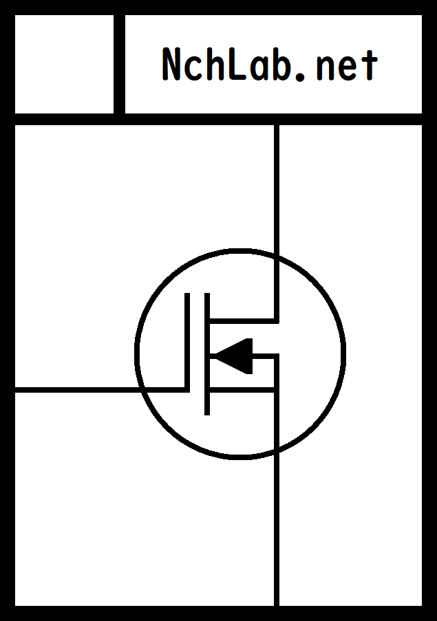
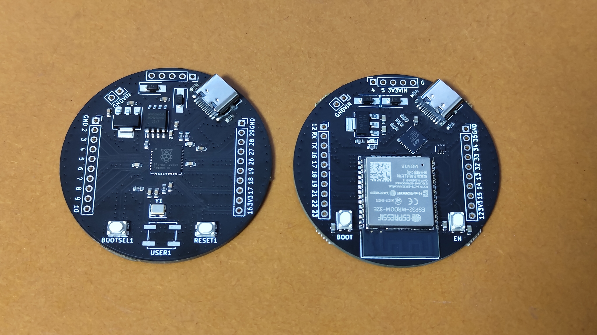
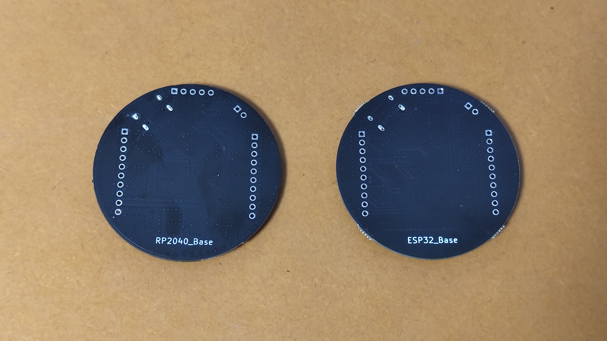
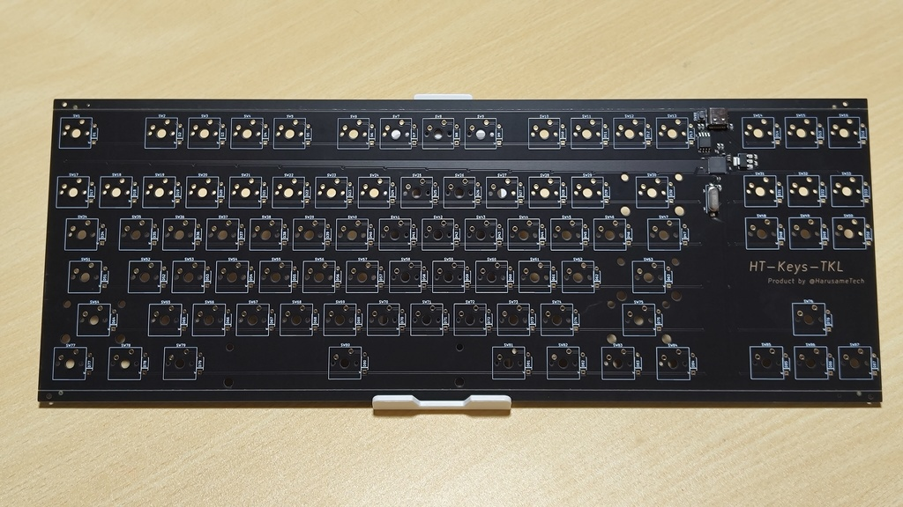

# コミックマーケット C102 特設サイト

やるきのないサークルカット

  

コミケット側のページはこちら  
<https://webcatalog.circle.ms/Perma/Circle/10464156/>

# 頒布物品

今回は初の試み（物理出展）ということで、オリジナルのマイコンボードと自作キーボード基板を頒布いたします

    
  

    

価格はそれぞれ 4,000 円と 10,0000 円を想定しています。少々お高いですが、個人制作という都合上どうしても高くなってしまうのはご容赦ください

## ESP32_Base

このページをご覧のみなさま、「缶サット」というものをご存知でしょうか？  
缶サットとは一言でいうと、「超小型模擬人工衛星」となります。人工衛星のオモチャバージョンと思っていただいて大丈夫だと思います

オモチャとは言っても立派な競技で、アメリカで行われる国際大会 [ARLISS](https://ja.wikipedia.org/wiki/ARLISS) では地上 4,000 km までロケットで打ち上げてミッションを遂行するような壮大なもので、国内でも缶サット甲子園や種子島ロケットコンテストなど、様々開催されています。

私自身は缶サットに 5, 6 年前（当時中学 2 年生）から取り組んでおり、いろんなミッションを遂行する機体やプログラムを作成してきました。それらはすべて Arduino Nano Every というマイコンを使用して作っていましたが、性能不足を感じることがままあり、高機能・高性能なマイコンが欲しくなりました

そこで、この「ESP32_Base」を開発しました。名前の通り、ESP32 を搭載しています。缶サットに必要かどうかはわかりませんが無線（Wi-Fi, Bluetooth）も使えます

Q. 缶サットでしか使えないなら意味なくない？  
A. そんなことはありません。中身はただの ESP32-WROOM-32E 開発ボードです。ただ丸いだけ

こう言ってしまってはアレですが、この製品はただ丸いだけの開発ボードです。直径は 50.8 mm で、秋月の[このユニバーサル基板](https://akizukidenshi.com/catalog/g/gP-08755/)と同じ大きさになっています。いつも四角いものばかり作らず、たまにはまるいのも作ってみませんか？　そういったシチュエーションに最適のボードです  
もちろん単体で使用することも可能で、LED を内蔵しているので L チカもできますし、Wi-Fi, Bluetooth を使った工作も可能です。FTP と組み合わせてファイルサーバを作るなんてこともできちゃいます

使い方は使う人次第。一風変わったマイコンボードを、お一ついかがでしょうか？

## HT-Keys-TKL

世の中には「自作キーボード」という分野があります。遊舎工房さんのページを見ると、ものすごい種類の基板が売られていることがわかります  
売られているものを買うだけでなく、イチから自分で作るなんて人もいます。私もその一人ですが

大体の製品は「Pro Micro」と呼ばれる、ATMega32U4 を搭載したマイコンボードを乗せているものが多く、それに付随して USB コネクタは Micro-B タイプ。それはまあいいんですが USB Type-C の方が時代にあってますよね

そんな疑問の答えを知るべく、HT-Keys シリーズの第一弾、HT-Keys-TKL は開発されました。TKL のとおりテンキーレスです。概要は以下の通り

- US 配列テンキーレス（87 キー）
- USB Type-C インターフェース採用
- CherryMX プロファイル
- RP2040 搭載 Raspberry Pi Pico 互換仕様
- ファームウェアレベルでカスタマイズ可能

USB コネクタは安心と信頼の Type-C を採用。MCU を基板に直接実装し、ユーザが購入する必要のある品数が減りました。キースイッチとキャップ、スタビライザだけで OK  
ちなみにケースはありません。もしほしい方がいらっしゃればご自身で設計・制作していただくか、正式発表をお待ちください。現在設計中です

Q. ファームウェアはどうするの？　QMK に対応してる？  
A. ファームウェアは用意していますが、残念ながら QMK には対応していません。~~QMK そんなに好きじゃないので~~

もちろんご自身で作成していただいても大丈夫です。Arduino, C++ SDK, Rust, microPython に対応していますので、お好みの言語をお選びください。私は Arduino で作成しました

コミケに来れない方、タイミング的に購入ができない方のために、Booth でも販売しています。ESP32_Base はコミケ終了後に公開しますが、HT-Keys-TKL は先行して発売していますのでご興味あればぜひどうぞ

- ESP32_Base  
<https://nch-mosfet.booth.pm/items/4957073>
- HT-Keys-TKL  
<https://harusametech.booth.pm/items/4568322>

Booth ショップのフォローもぜひ！

- MOS-Shop  
<https://nch-mosfet.booth.pm/>
- HarusameTech 直販所  
<https://harusametech.booth.pm/>
