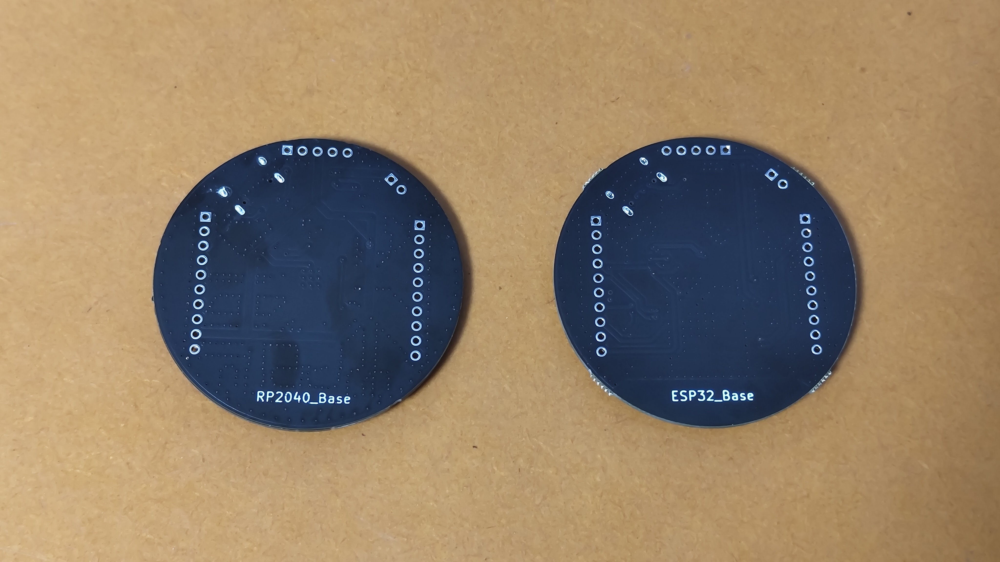

# NchLab.net サークル公式サイト

# About US

なまえ：NchLab.net  
よみ：エヌチャンラボネット

NchLab.net はものづくり系の個人サークルです

# 特設サイト

コミックマーケット C102 特設サイトはこちら  
→ <https://circle.nchlab.net/C102/>

# 主な活動紹介

## 缶サット向けオリジナルマイコンの設計、製造、販売

  

  缶サットのイメージ図

現在缶サット向けマイコンボードとして、以下のものを開発中です

- ESP32_Base（ESP32-WROOM-32E 搭載）
- RP2040_Base（RP2040 搭載）

  
  

※ESP32 版は開発完了し、在庫を確保しました。RP2040 版については諸事情によりしばらく開発を停止しています

ESP32_Base の使い方についてはこちらをご参照ください  
<https://circle.nchlab.net/product/ESP32_Base/How-to-use_ESP32_Base.html>

また、既存のArduino Nano を缶サットとして用いるための基板を作成しました

  
  
  

Booth にて頒布しております。Arduino Nano, Nano Every をお持ちの方向けとなります  
<https://booth.pm/ja/items/4782004>

詳細はこちらの GitHub リポジトリをご参照ください  
<https://github.com/Nch-MOSFET/CanSatForBeginners>

## ちょっと変わった自作キーボード設計、製造、販売

現在構想中 by はるさめ[@HarusameTech](https://twitter.com/HarusameTech)
