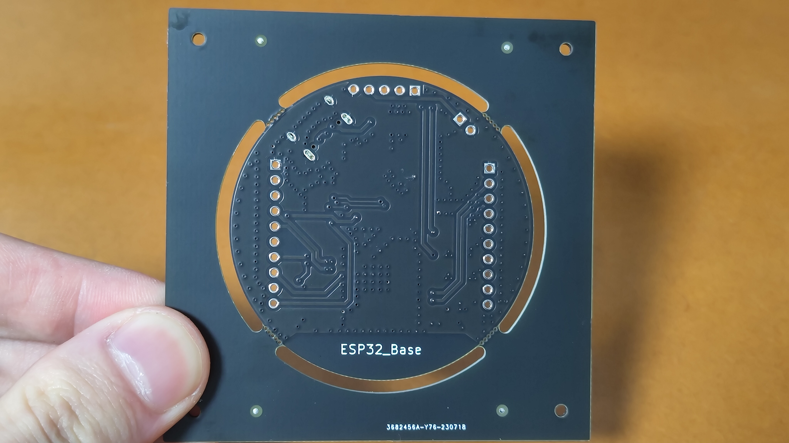
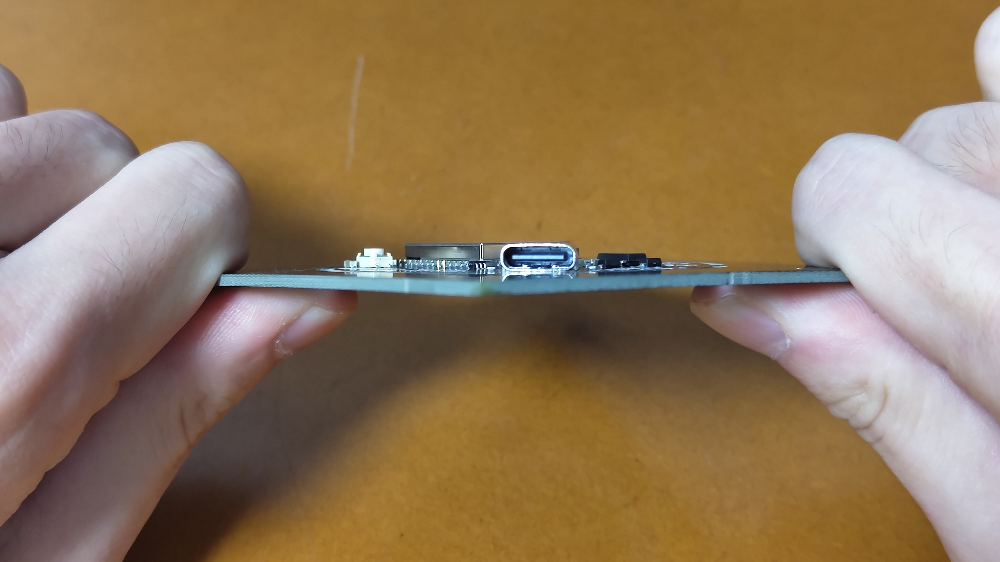
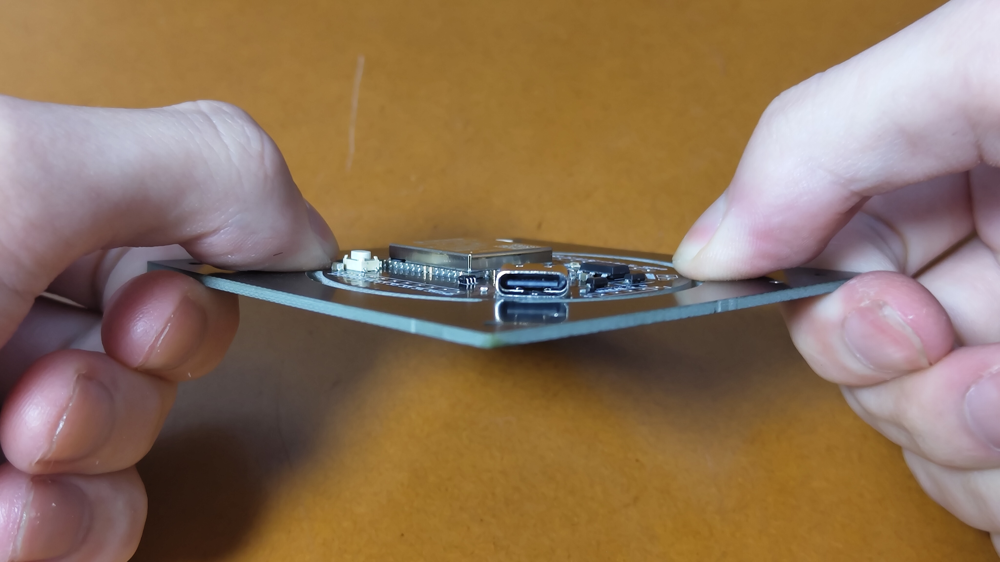

# ESP32_Base の使い方

## ①本体側の準備

<div align="center">
    
</div>

枠が付いたままでは USB コネクタにケーブルを挿せないため、枠を外します  
本体と枠の接続部分を親指で上下から強く押しながら繰り返し曲げます。4 隅とも数回繰り返すと外せます

<div align="center">
    
    
</div>

## ②PC 側の準備

各種解説サイトを参考に、Arduino IDE と ESP32 の環境をセットアップしてください。あえてここでは触れません

## ③動作確認

以下のスケッチをコピペし、L チカが動くことを確認します  
ESP32 本体右下の LED が点滅します

```cpp
#define LED 4

void setup() {
  pinMode(LED, OUTPUT);
}

void loop() {
  digitalWrite(LED, HIGH);
  delay(250);
  digitalWrite(LED,  LOW);
  delay(250);
}
```

尚、ボードは「ESP32 Dev Module」を選択して下さい
